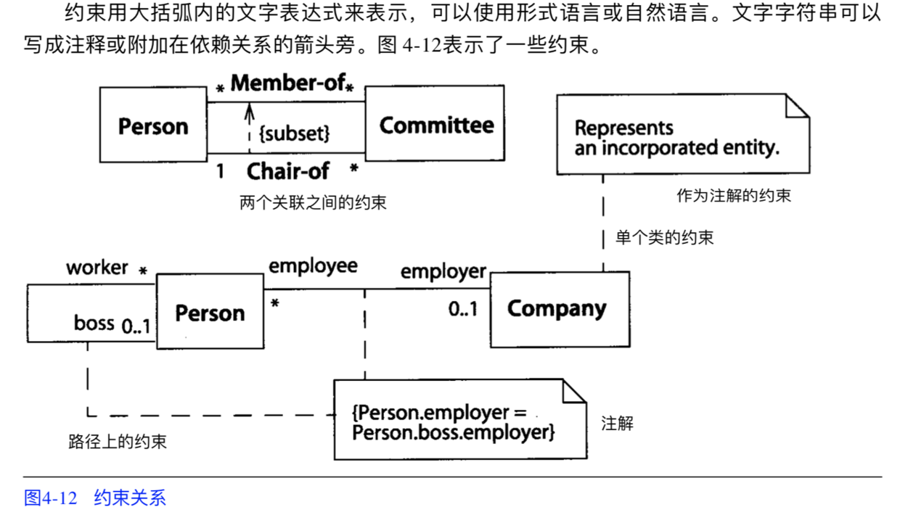

# UMLLearn

### 一、类元
就是在 UML 图中的一个节点，或者说是一个元素。如下所示：  

### 二、关系
上面的那些类元，在实际的 UML 中都有些什么关系呢？如下所示：    
  
这里要注意的一个问题是，箭头的指向。

HGPerson 继承于 NSObject，所以 HGPerson 是 NSObject 的子类。箭头是 **子类指向父（超）类**。

### 三、泛化
实际就是类之间的继承关系，泛化用从子指向父的箭头表示，指向父的是一个空三角形(如图 4-7 表示)。多个泛化关系可以用箭头线组成的树来表示，每一个分支指向一个子类。样例：

### 四、实现
实现关系用一条带封闭空箭头的虚线来表示(如图 4-9)，且与泛化的符号很相像。

用一种特殊的折叠符号来表示接口(无内容)以及实现接口的类或构件。接口用一个圆圈表示，它通过实线附在表示类元的矩形上(如图4-10)。

### 五、依赖
##### 描述

##### 种类

##### 依赖关系

### 六、约束
以我简朴的理解，约束就是一些通过文案来辅助描述。如下所示：

### 七、其它

### 八、工具
#### 8.1 OmniGraffle

<image src="Resource/png/OmniGraffle.png"/>

#### 8.2 StarUML

<image src="Resource/png/StarUML.png"/>

 