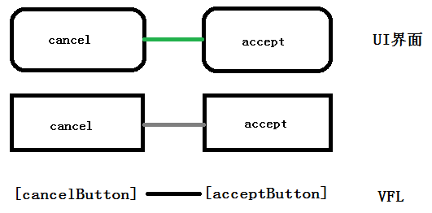
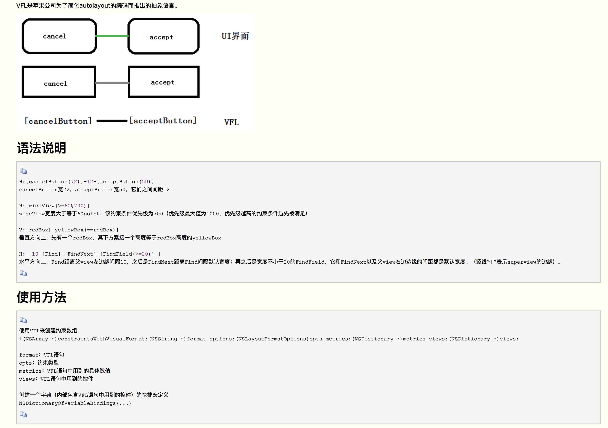
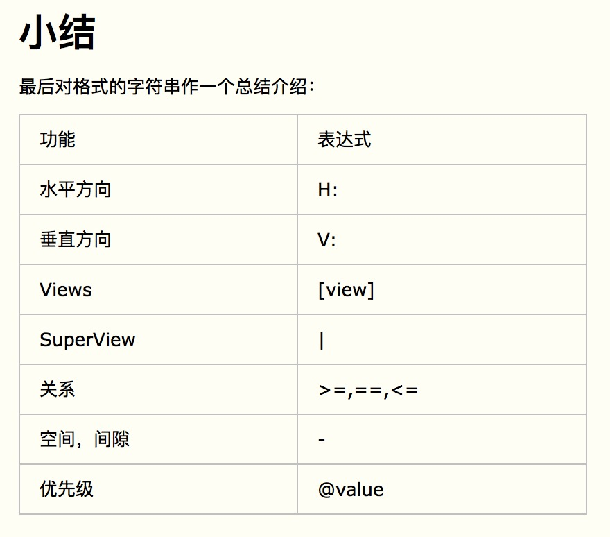

## 什么是VFL语言  
[参考连接](https://www.cnblogs.com/chars/p/5146607.html)  

[项目代码](./Resource/VFL)


  
  
  

```
metrics 这里是一个字典，当在format中使用了动态数据比如上现这句:@"H:|-[button(==width)]-|",表示这个button的宽度为width,那么这个参数去哪里找呢？就是在这个字典里面找到key对应的值，如果没有找到这个值，app会crash
```
